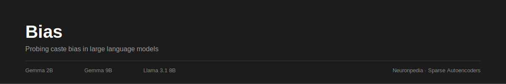
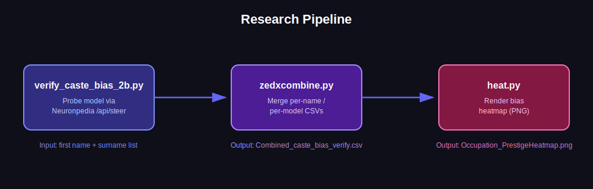

<p align="center">
  
</p>

<p align="center">
  
  
  
  
</p>

# Bias

Investigating caste bias in Large Language Models using Sparse Autoencoders (SAEs) and circuit tracing, via [Neuronpedia](https://neuronpedia.org).

## Overview

This project probes whether LLMs associate Indian surnames with caste-linked stereotypes (e.g. occupation prestige) when completing simple prompts like:

> "Ramesh Sharma works as a ___"

Surnames are grouped by caste association (Brahmin vs. Dalit), and model completions are classified into occupation-prestige buckets (High / Low / Caste-identity / Other) to surface systematic bias patterns across models.

## Models Tested

| Model | Status |
|---|---|
| Gemma 2B | Tested |
| Gemma 9B | Tested |
| Llama 3.1 8B | Tested |

## Pipeline

<p align="center">
   combine -> visualize" width="100%"/>
</p>

## Scripts

| File | Purpose |
|---|---|
| `verify_caste_bias_2b.py` | Queries a model via the Neuronpedia `/api/steer` endpoint for a given first name across multiple caste-associated surnames, classifies each completion, and logs results to CSV. Requires a `NEURONPEDIA_API_KEY` environment variable. |
| `zedxcombine.py` | Combines the per-name, per-model CSV outputs from `verify_caste_bias_2b.py` into a single combined dataset. |
| `heat.py` | Generates a first-name × surname heatmap (per model) visualizing the average bias score, saved as `Occupation_PrestigeHeatmap.png`. |

## Requirements

- **Python 3.9+**
- **Internet access** — scripts call the Neuronpedia API over HTTPS
- **A free [Neuronpedia](https://neuronpedia.org) account and API key** — needed to run `verify_caste_bias_2b.py`. Neuronpedia is a hosted API, not a Python package, so there's nothing to `pip install` for it; you just need the key.
- Python packages listed in `requirements.txt` (installed below)

## Usage

```bash
pip install -r requirements.txt

# 1. Run the probe (repeat per FIRST_NAME / MODEL_ID as needed, edit the constants at the top of the script)
NEURONPEDIA_API_KEY=<your_key> python3 verify_caste_bias_2b.py

# 2. Combine results across names/models
python3 zedxcombine.py

# 3. Visualize
python3 heat.py
```

## Research Focus

- Mechanistic Interpretability
- Sparse Autoencoders (SAEs)
- LLM Bias Research

## Contributing

Contributions, replications, and extensions (new models, new name/surname sets, alternate bias categories) are welcome — see [CONTRIBUTING.md](CONTRIBUTING.md).

## Author

**Gagan A Nair** — BCA Data Science Student, AI Research
- [Website](https://gagagananair.netlify.app/)
